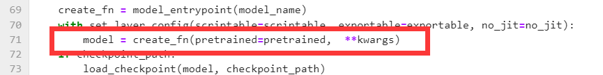
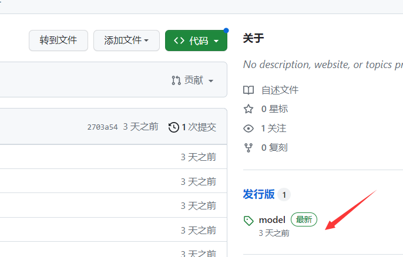

[中文文档请点击这里](https://github.com/BAOfanTing/snake2023Test/edit/main/README_cn.md)
# snake2023Test

## 1. Installation environment and preparation of data

First, prepare Python 3.8 and Python 1.11.0, Cuda version 11.3, install the required libraries, and download pre training weights

```
pip install -r requriments.txt
```


### Delete some codes from the Timm library

Find the path python3.8/site-packages/timm/models/factory. py and remove the code in line 71'pretrained_cfg=pretrained_cfg'



## 2. Place images and download models

Place the test images in the folder data SnapeCLEF2023 test_ images.

Download the model from the distribution




## 3. Testing

Select the correct yaml for the corresponding model, for example, 'meta_2_838_384. pth' corresponds to meta_ 2_ 384_ snake.yaml,

Modify the path of pth to obtain the CSV prediction file main/output/MetaFG_ meta_ 2/OUTPUT_ TAG/result_ snakeclef2023test.tc.result.csv


```
cd /root/autodl-tmp/main/
python -m torch.distributed.launch --nproc_per_node 1 --master_port 12345 main_Test_TTA.py --eval --cfg ./configs/MetaFG_meta_2_384_snake.yaml --batch-size 16 --tag OUTPUT_TAG --dataset snakeclef2023test --resume /root/autodl-tmp/main/meta_2_825_384.pth --opts DATA.IMG_SIZE 384 TRAIN.AUTO_RESUME False
```
