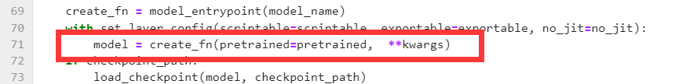

English Documentation Please Click [here](https://github.com/BAOfanTing/snake2023Test/edit/main/README.md)
# snake2023Test

## 1、安装环境和准备数据，下载模型权重
首先准备python3.8和pytorch 1.11.0,cuda版本11.3，安装必须库，下载预训练权重

```
pip install -r requriments.txt
```

### 删除timm库部分代码
找到该路径python3.8/site-packages/timm/models/factory.py，删除第71行的pretrained_cfg=pretrained_cfg



## 2、放置图片，下载模型
将测试图片放在该文件夹下data\SnakeCLEF2023-test_images
从发行版下载模型


## 3、测试
对应模型选择正确的cfg，例如meta_2_838_384.pth对应meta_2_384_snake.yaml
修改pth的路径，得到csv预测文件main/output/MetaFG_meta_2/OUTPUT_TAG/result_snakeclef2023test.tc.result.csv

```
cd /root/autodl-tmp/main/
python -m torch.distributed.launch --nproc_per_node 1 --master_port 12345 main_Test_TTA.py --eval --cfg ./configs/MetaFG_meta_2_384_snake.yaml --batch-size 16 --tag OUTPUT_TAG --dataset snakeclef2023test --resume /root/autodl-tmp/main/meta_2_825_384.pth --opts DATA.IMG_SIZE 384 TRAIN.AUTO_RESUME False
```
